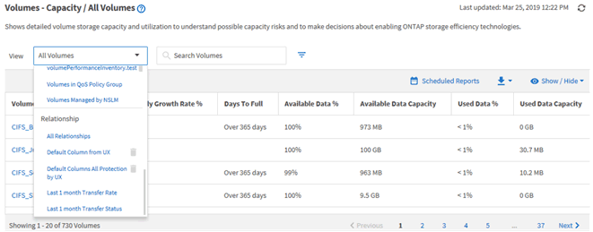

= Comprendre la relation de vue et de rapport
:allow-uri-read: 
:icons: font
:imagesdir: ../media/

[role="lead"]
Les pages d'affichage et d'inventaire deviennent des rapports lorsque vous les téléchargez ou les planifiez.

Vous pouvez personnaliser et enregistrer les vues et les pages d'inventaire pour les réutiliser. La quasi-totalité des informations qu'il est possible d'afficher dans Unified Manager peuvent être enregistrées, réutilisées, planifiées ou partagées comme un rapport.

Dans la liste déroulante de la vue, les éléments avec l'icône de suppression sont des vues personnalisées existantes que vous ou un autre utilisateur avez créées. Les éléments sans icône représentent les vues par défaut fournies par Unified Manager. Les vues par défaut ne peuvent pas être modifiées ni supprimées.

[NOTE]
====
Si vous supprimez une vue personnalisée de la liste, elle supprime également tous les rapports programmés qui utilisent cette vue. Si vous modifiez une vue personnalisée, les rapports qui utilisent cette vue contiennent la modification lors de la prochaine génération et envoi du rapport par e-mail selon le planning du rapport.

====

Seuls les utilisateurs disposant du rôle Administrateur d'applications ou Administrateur de stockage peuvent voir l'icône de suppression, modifier ou supprimer une vue, ou modifier ou supprimer un rapport planifié.
